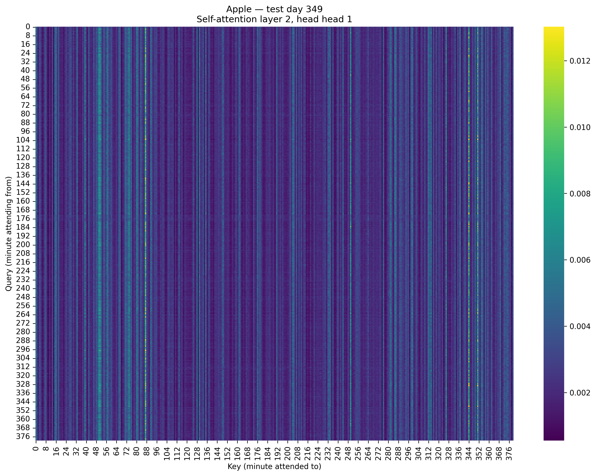
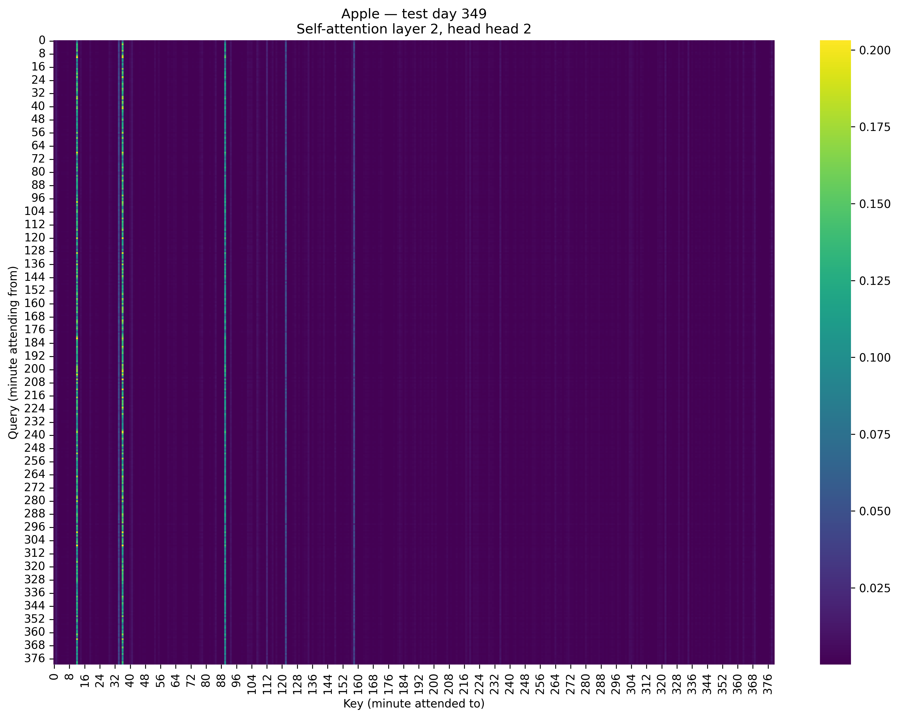

# VolFormer: A Transformer-Based Approach to Stock Volatility Forecasting


[](master_thesis.pdf)


## 📌 Project Overview

**VolFormer** is a specialized Transformer architecture designed to forecast **Realized Volatility (RV)** in financial markets. Developed as part of a Master's Thesis at UC3M, this project bridges the gap between state-of-the-art Natural Language Processing techniques and financial time-series analysis.

By treating intraday return sequences as "tokens," VolFormer leverages self-attention mechanisms to capture complex, non-linear temporal dependencies that traditional econometric models (like HAR-RV) often miss.

> **Why Volatility?**
> Accurate volatility forecasting is the cornerstone of **quantitative risk management** and **options pricing**. In a market driven by uncertainty, the ability to anticipate variance allows institutional investors to hedge effectively and price derivatives with greater precision.

---

## 🚀 Key Engineering Features

This repository is built on a **modular, production-oriented framework** designed for reproducibility and scalability in financial machine learning.

- **🏗️ Modular Architecture**: The codebase is strictly decoupled into distinct domains (`data`, `models`, `training`), ensuring separation of concerns, easy extensibility, and robust testability.
- **⚙️ Config-Driven Experiments**: Training runs are fully defined by centralized YAML configuration files, eliminating hardcoded hyperparameters and ensuring every experiment is strictly reproducible.
- **📊 Professional Logging**: An integrated `logging` system provides structured, persistent tracking of experiments, metrics, and model states.
- **⚡ CUDA-Optimized**: Data pipelines and training loops are engineered for high-performance GPU acceleration, utilizing Mixed Precision (AMP) and pinned memory to maximize throughput during large-scale training.
- **🛡️ Data Leakage Protection**: The preprocessing pipeline implements rigorous validation (e.g., removing overnight returns, strict day alignment) to ensure no future information leaks into the training set—a critical requirement for valid financial backtesting.

---

## 🧠 The VolFormer Model

At its core, VolFormer adapts the standard Transformer Encoder for regression tasks:
*   **Input**: Rolling window of intraday log-returns (e.g., 10-minute intervals).
*   **Positional Encodings**: Learnable embeddings to retain temporal order.
*   **Self-Attention**: Multi-head attention layers that allow the model to weigh the importance of different intraday periods dynamically.
*   **CLS Token**: A learnable token (similar to BERT) pools the sequence information into a single context vector for the final volatility prediction.

---

## 📂 Project Structure

```text
.
├── configs/                 # Experiment configurations
│   ├── default.yaml         # Main training config
│   └── test_config.yaml     # CI/CD test config
├── master_thesis.pdf        # final thesis pdf
├── plots/                   # Visualization assets
├── raw_data/                # Dataset storage
├── src/                     # Source code
│   ├── data/                # Data ingestion & preprocessing
│   │   ├── dataset.py
│   │   └── preprocessing.py
│   ├── models/              # PyTorch model definitions
│   │   └── volformer.py
│   └── training/            # Training loop & utilities
│       ├── trainer.py
│       └── logger.py
├── train.py                 # CLI entry point
└── requirements.txt         # Dependencies
```

---

## 🛠️ Getting Started

### Prerequisites
*   Python 3.9+
*   CUDA-capable GPU (recommended)

### Installation

1.  **Clone the repository**:
    ```bash
    git clone https://github.com/NicolasBuehringer/uc3m_master_thesis.git
    cd uc3m_master_thesis
    ```

2.  **Install dependencies**:
    ```bash
    pip install -r requirements.txt
    ```

### Running Experiments

To start a training session using the default configuration:

```bash
python3 train.py --config configs/default.yaml
```

To run a custom experiment, duplicate a config file, modify the parameters (e.g., `d_model`, `lr`), and run:

```bash
python3 train.py --config configs/my_experiment.yaml
```

---

## 📈 Visuals & Results

One of the key advantages of Attention mechanisms is **interpretability**. The heatmaps below illustrate how VolFormer attends to specific intraday intervals during high-volatility events, effectively "learning" which times of day are most predictive.

| **Head 1 Attention Pattern** | **Head 2 Attention Pattern** |
|:----------------------------:|:----------------------------:|
|  |  |
| *Broader attention across the trading day* | *Focus on specific anchoring minutes* |

---

## 🎓 Academic Context

This project was developed for a **Master's Thesis** at **Universidad Carlos III de Madrid (UC3M)**. The research focused on benchmarking Deep Learning architectures against established heterogeneous autoregressive (HAR) models in the context of high-frequency trading data.

---

## 📜 License

This project features a dual-licensing structure to respect both open-source software standards and academic intellectual property:

* **Code:** The source code in this repository is distributed under the **MIT License**. You are free to use, modify, and distribute the code for any purpose, provided credit is given.
* **Thesis Document:** The written dissertation (`master_thesis.pdf`) is licensed under **Creative Commons Attribution – Non Commercial – Non Derivatives (CC BY-NC-ND)**.
